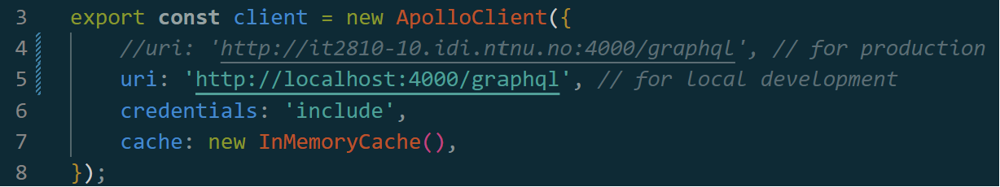
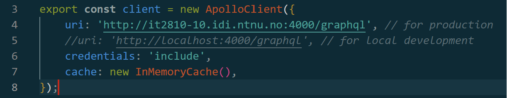

# [Productway](http://it2810-10.idi.ntnu.no/)

The application allows a user to search for grocery products in order to look up information, such as price, rate the product or favorite it. It uses a pre-populated database of products and their information to present the information and perform searches. The user is able to search by name, filter by one or more categories, include a price range, and order the presented items by price

## Installation and running the project

1. To begin, clone the repository and proceed to the project directory.

2. Inside the base-repository (prosjekt-2), execute the following commands to initiate the website:

```
npm run setup
```

This will install all dependencies for the project

```
npm run dev
```

This will start the server aswell as the client.

Further details regarding the client can be found [here](client/readme.md) and the server [here](server/readme.md)

3. To access the project, open a web browser and navigate to http://localhost:5173/.

### Test-database

For local development a test-database have been utilized. To configure the project for local development;

-   Comment out line 4 in [apolloClient.ts](./client/src/graphql/apolloClient.ts)
-   Uncomment line 5 as shown in the picture bellow


<br><br>
The project will now run with the test-database.

### Production-database

For running with the production database;

-   Make sure [apolloClient.ts](./client/src/graphql/apolloClient.ts) is as shown in this picture
    

Note: The production server is hosted on an NTNU Virtual Machine at
[http://it2810-10.idi.ntnu.no:4000](http://it2810-10.idi.ntnu.no:4000).
Connection to the server requires an active NTNU network connection (via on-campus presence or VPN).

### Use of the website

When opening the landing page, the user is presented with "Todays product", and 9 possible categories. Upon selecting one of these, the user is redirected to the results-page, where it is presented with a collection of products fitting the category. Here, the user can search for a product, filter by one or more categories, include a price range, and order the presented items by price. When the user adds a category it acts as union, rather than a intersection. This means that when a user checks both "Dessert" and "Middag", the server retrieves items from both those categories at the same time. The user can also click on a product to view more information about it. Here, the user can rate the product, favorite it, and view other users' ratings. The user can also click on the "Home"-button to return to the landing page, or click on the "Favorites"-button to view its favorites.

## Sustainability

In order for the application to run in a sustainable manner, several actions were made to limit the amount of queries to the database.
<br><br>
When writing in a search in the searchbar, it waits a second before it fetches suggestions. This is to let the user type the whole query before fetching, instead of fetching each time it types or removes a character. This has little effect on the user experience but significantly reduces the number of queries.. <br><br>
In the results-page, the user is presented with a collection of products fitting its filters. This page is implemented as a pagianted presentation. The page is presented with 12 products, and to view more, the user will have to swap page at the bottom. This is a normal way to limit the amount of traffic from the database, as it now only fetches 16 items at each page. As a minor addition, we have also implemented lazy loading of images. This has a greater effect on mobile-viewing, as less items are viewable at the same time.

## Universal design

The website is designed in a way to tackle the possible variants of screen-sizes. For PC, box-like elements are placed in a grid, expanding downwards, while for a phone, the elements a placed in a longer nx1 column. We have made sure everything is readable, with high contrast everywhere. Headers use the h-tags, aria-labels for all navigation and usage, aswell as all pictures have an alt-tag, consisting of the name of the product. This ensures that machine reading is effective if necessary.

## Gitlab

The website is developed using gitlab. Gitlab was used to manage the project, and a pipeline was setup to ensure code quality. The pipeline runs tests, linting and prettier, which ensures that the website is working as intended

## Testing

The project consists of 3 different test types. Unit tests, end-to-end tests and resolver tests.

All the tests can be ran by executing the following command in the base (prosjekt-2) directory:

```
npm setup
npm run test
```

### Unit tests

We've conducted testing using Vitest and React Testing Library. The unit tests and snapshot tests guarantee accurate rendering and expected behavior of the components.

You can find the component tests [here](/client/src/test/)
The unit tests can be run by executing the following command in the base (prosjekt-2) directory:

```
npm run setup
npm run test:client
```

### End-to-end tests

For end-to-end testing, we employed Playwright. These tests verify that the application behaves appropriately in response to user actions. The tests are written in a way that they can be run on any browser.

You can find the e2e tests [here](/playwright/tests/)
The e2e tests can be run by executing the following command in the base (prosjekt-2) directory:

```
npm run setup
npm run test:e2e
```

**Note**: Some of the sometimes needs several tries. When this happens the test is regarded as "flaky", which is represented by yellow warning-sign. When this happens the test was successfull, but needed more than one try.

### Resolver tests

The resolvers are tested using Vitest. These tests verify that the resolvers behave appropriately in response to user actions. The resolvers are tested by mocking the database and testing the resolvers against these mock database. This ensures that the resolvers behave as expected. To mock the database we use an in-memory database provided by mongo.

You can find the resolver tests [here](/server/resolvers/__tests__/)
The resolver tests can be run by executing the following command in the base (prosjekt-2) directory:

```
npm run setup
npm run test:server
```

## More available scripts

All these scripts needs to be run from the base directory (prosjekt-2), and some of them requires the setup script to be run first.

<br>
To only run the client

```
npm run dev:client
```

<br>
To only run the server

```
npm run dev:server
```

<br>
To build the application

```
npm run build
```

<br>
To run linting

```
npm run lint
```

<br>
To fix linting errors

```
npm run lint:fix
```

<br>
To run prettier

```
npm run format
```

<br>
To check for prettier errors

```
npm run format:check
```
